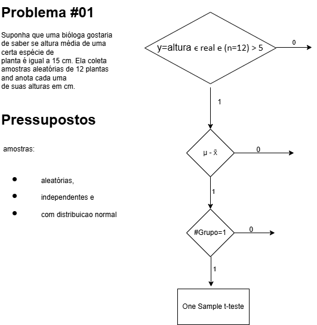

# Exemplos de Testes de Hipóteses

Este repositório contém exemplos práticos de testes de hipóteses estatísticas, com código e explicações detalhadas.
## 1.0 Apresentação do Problema #02

Pesquisadores gostariam de saber se duas espécies diferentes de plantas tem a mesma 
altura média. Eles coletaram amostras aleatórias de 20 plantas de cada espécie.

## Conteúdo

* `teste_t.py`: Exemplo de teste t para comparar médias.
*   ```
    df1 = np.array([14, 15, 15, 16, 13, 8, 14, 17, 16, 14, 19, 20, 21, 15, 15, 16, 16, 13, 14, 12])
    df2 = np.array([15, 17, 14, 17, 14, 8, 12, 19, 19, 14, 17, 22, 24, 16, 13, 16, 13, 18, 15, 13])
    ```

## Diagrama com a descrição do problema e a escolha do teste


## Instruções

### 3.1 Avaliando os pressupostos sobre os dados
#### 3.1.1 Aleatoriedade
#### 3.1.2 Independência
#### 3.1.3 Normalidade

### 4.1 Aplicação do 
    ? two Sample t-test
#### Brever conclusao
#### Estatística t: -1.6848470783484626
#### Valor p: 0.12014460742498101
#### Não rejeitou-se a hipótese nula. Não há evidências estatísticas de que a média da amostra seja diferente da média populacional.

#### A um nivel significancia de 0.05 Não rejeitamos a hipótese nula. Não há evidências estatísticas de que a média da amostra de 14.33 seja diferente da média populacional de 15.
#### A diferencao de 0.67, entre as  médias 15 - 14.33, resulta da aleatoriedade dos dados e não é significativa ao nível de significância de 0.05.

1.  Clone o repositório: `git clone https://github.com/dolthub/dolt`
2.  Instale as dependências: `pip install pandas numpy scipy`
3.  Execute os scripts Python: `python teste_t.py`

## Exemplos

### Teste t

... (explicação do teste t e código)

### Qui-quadrado

... (explicação do teste qui-quadrado e código)

## Contribuição

... (instruções para contribuir)

## Licença

MIT License
